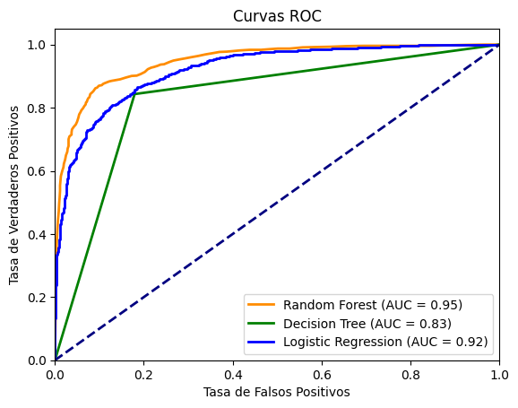
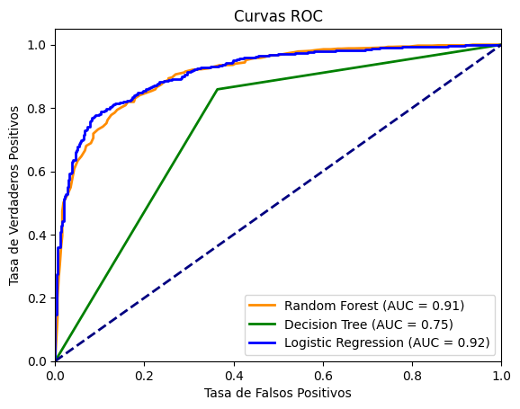
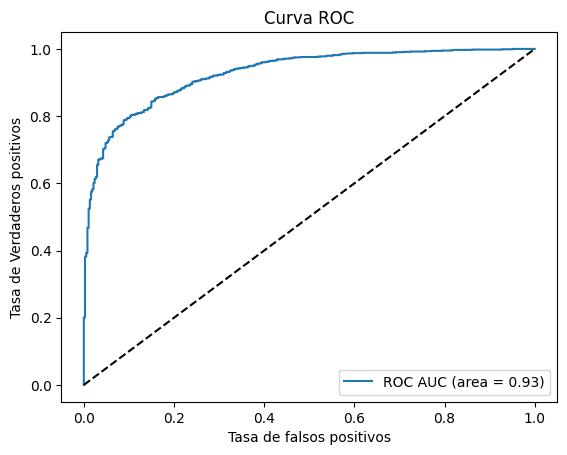

## Prediccion de abandono de Clientes (Churn) con XGBoost, LinearRegression y RandomForest
 
### Introducción
Cuando se trata de aplicaciones útiles del Machine Learning en un área comercial, nada representa mejor esto que que la predicción de abandono de clientes. Es un problema en el que generalmente se tienen una buena calidad y cantidad de datos, es relativamente sencillo y resolverlo puede suponer un aumento de la retencion del clientes, por lo tanto aumento de ganancias.

La tasa de abandono es crítica si queremos entender la satisfacción del cliente. Tasas de abandono bajas = clientes satisfechos; las altas tasas de abandono significan que algo anda mal. **Lo que puede parecer pequeña tasa de rotación mensual o trimestral se acumula y ese 1% se traducirá rápidamente en 12 % de abandono anual.** Un abandono del 2% de clientes para una empresa que factura 5 millones anuales se traduce en 100,000€ en ingresos perdidos.

[Segun este informe de Callminer,](https://learning.callminer.com/c/whitepaper-churn-index-2020?x=CFl8z6&xs=225891#page=1) **la rotación cuesta a las empresas en Estados Unidos un estimado de $ 168 mil millones anuales.** Esto se debe a que pequeños porcentajes sumados se convierten en una gran perdida de ganancias reales. Por otra parte está el costo de atraer nuevos clientes lo cual suele ser mayor al de retener a los actuales. 
**Lógicamente, todo esto, tiene un impacto en el crecimiento del negocio.**

Debemos ver más allá de las suposiciones, los métodos tradicionales ya no son suficientes para saber las causas o qué hacer con la rotación. Es mejor usar los datos que podemos recolectar de nuestros clientes para entender su comportamiento y a partir de ahí, tomar decisiones basadas en datos, identificar tendencias y patrones que nos lleven a conclusiones firmes.

## Pasos para abordar el problema.

Estos pasos son analogos a casi cualqueir problema de machine learning.

1. **Definición de problema y objetivo**: Debemos comprender qué quiero lograr con el análisis y la predicción, para escoger cuales datos son buenos y cuales no. (Puede parecer obvio)

2. **¿Que datos tenemos?**: Especificar que datos usaremos y si los tenemos disponibles para extraerlos y analizarlos. Algunas fuentes son los sistemas CRM, los servicios de análisis y encuestas de satisfacción del cliente.

3. **Preparación, exploración y preprocesamiento de datos**: Una vez tenemos los datos debemos analizarlos para limpiarlos y crear modelos predictivos debemos transformarlos en formatos adecuados para los algoritmos de Machine Learning . Este paso es crucial para mejroar los resultados generales al aumentar la calidad de los datos.

4. **Crear modelos y probar**: Esto es el desarrollo de varios modelos de predicción y su posterior prueba para validar su eficacia.

5. **Escoger el mejor modelo e implementarlo con datos reales**: En esta ultima etapa el modelo más adecuado se despliega a producción. Puede integrarse en un software existente o crear una interfaz de usuario para que lo aprovechen otros miembros del equipo. Este es un proceso iterativo y puedes volver a etapas anteriores para hacer correciones.

## Planteamiento.

Por mi partee, voy a usar un Dataset de una compañia de Telecomunicaciones, estos datos están bastante completos pero requieren procesarlos para representarlos de la mejor maneara en los diferentes algoritmos de clasificación, como **XGBoost, Arboles de decision y Random Forest, además de LinearRegression para clasificación** ya que nuestro objetivo principal es crear un modelo robusto "que pueda predecir el perfil de **clientes que son propensos a abandonar"** y asi tomar acciones a tiempo para retenerlos, es sabido que **retener clientes es mucho mas barato que captar nuevos.**

### Análisis BI.

[Anteriormente ya habia analizado estos datos con Pandas y Power BI](https://github.com/ricardobrein/BI-analysis-Abandono_de_clientes-Maven-Telecom) y creé un informe sobre ellos con las posibles medidas a tomar. Este Repositorio es complementario con aquel ya que utilizamos los mismo datos, esta vez para crear varios modelos de clasificación que, como he mencionado, nos ayuden a identificar clientes propensos a abandonar la compañia. Esto es importante para crear estrategias para evitarlo o reducirlo, por ejemplo, **creando campañas de marketing proactivas dirigidas a los clientes que están a punto de abandonar.**

Cuando una empresa tiene como modelo de negocio la suscripción, logra capturar efectivamente los datos de los clientes y sus comportamientos,  el Machine Learning y el análisis de datos son herramientas poderosas para identificar y predecir la rotación trabajando sobre aspectos como:

- Identificar clientes en riesgo.
- Identificar fallos en nuestra compañía y los intereses y comportamientos del cliente.
- Identificar estrategias/métodos para reducir la rotación y aumentar la retención.

### Casos a los que se puede aplicar un análisis de rotación.

La predicción de abandono de clientes varía según la línea de negocio (LoB) de cada empresa, depende también de los datos disponibles y los objetivos que se busquen, es interesante entender el negocio para aplicarlo correcatamente en cada caso. El modelo debe adaptarse a las necesidades, objetivos y expectativas de la empresa. Por ejemplo, algunos casos de uso son:

- Telecomunicaciones (Su modelo de negocio va dirigido a retener a los clientes durante el mayor tiempo).
- Software as a Service (SaaS).  Modelos de pago por uso: servicios cloud, AWS,GPC, Azure, Microsoft 365.
- Empresas basadas en suscripción (servicios de streaming de video, música, etc.).
- Instituciones financieras (bancarias, compañías de seguros, Sociedades Hipotecarias, etc.).
- Marketing.
- Gestión de Recursos Humanos (rotación de empleados).

### Construccion del modelo.

Construir un modelo efectivo presenta desafíos que tienen relación con la existencia de datos inexactos o desordenados, debemos también conocer contexto del negocio para entender los datos y hacer la seleccion de caracteristicas adecuadas, manejar datos faltantes y desequilibrio en datos. Superar estos desafíos es fundamental para desarrollar un modelo útil y eficaz.

En nuestro caso la variable objetivo "Customer Status" tiene un desbalance ya que de los 7043 clientes solo 1869 han abandonado la compañia, esto podria llevar a modelos sesgados hacia la clase dominante, en este caso los clientes actuales. Utilice dos enfoques para manejarlo, la estratificación y el Oversampling con la tecnica **SMOTE.**

Por otro lado, habian variables categoricas binarias y multi-clase, las cuales es conveniente convertirlas en representaciones numéricas mediante técnicas de Encoding. Al igual que algunas variables numéricas que, por su alta variabilidad, tuve que escalar y normalizar para asegurar que tengan un impacto equilibrado en el modelo final.

[Notebook del codigo del modelo]

### Evaluación del modelo 

En los modelos de ML en clasificacion podemos usar ciertas metricas.

1. Precisión: La precisión mide la proporción de ejemplos positivos que fueron clasificados correctamente como positivos, es decir, la capacidad del modelo para no etiquetar incorrectamente ejemplos negativos como positivos. **Se calcula dividiendo el número de verdaderos positivos (TP) entre la suma de los verdaderos positivos y los falsos positivos (FP):

Precisión = TP / (TP + FP)

2. Recall: También conocido como sensibilidad o tasa de verdaderos positivos, el recall mide la proporción de ejemplos positivos que fueron clasificados correctamente como positivos en relación con todos los ejemplos positivos reales.

Recall = TP / (TP + FN)

3. F1 score = (media) * (precision * recall) / (precision + recall)

4. La Análisis de la curva ROC
[Curva ROC] (https://es.wikipedia.org/wiki/Curva_ROC)

ROC, (Receiver Operating Characteristic) y el área bajo la curva (AUC) son métricas normalmente utilizadas para evaluar el rendimiento de modelos de clasificación.

En términos sencillos, la curva ROC representa **la relación entre la tasa de verdaderos positivos (recall o sensibilidad) y la tasa de falsos positivos (1 - especificidad)** a medida que se ajusta el umbral de clasificación del modelo. La curva ROC muestra cómo el modelo equilibra la capacidad para identificar correctamente las instancias positivas (verdaderos positivos) y la tasa de negativos clasificados incorrectamente como positivas (falsos positivos).

**El área bajo la curva (AUC)** es una métrica numérica que resume el rendimiento de la curva ROC. El valor del AUC varía entre 0 y 1, donde un valor de 1 indica un modelo perfecto que clasifica correctamente todas las instancias(en la mayoria de casos no sería deseable ya que indica sobreajuste hacia los datos de entrenamiento) y un valor de 0.5 indica que el modelo clasifica aleatoriamente.
En el modelo construido con **oversampling**, (igualando la variable objetivo con las varibales de entrenamiento) obtuve buenos resultados de precision, recall, y f1 score.**

> La clases( 0 y 1) son nuestra variable objetivo _churn = no  y churn = yes_ vemos que logramos buenos resultados a predecir ambas clases, destacando los de el modelo Random Forest.

**Logistic Regression:**
 Accuracy: 0.836231884057971
 Precision: 0.8495934959349594
 Recall: 0.8140214216163584
 F1-score: 0.8314271506713079

    Reporte de Clasificación:
               precision    recall  f1-score   support

           0       0.82      0.86      0.84      1043
           1       0.85      0.81      0.83      1027
---------------------------------------------------------------------
**Decision Tree:**
 Accuracy: 0.8318840579710145
 Precision: 0.8224121557454891
 Recall: 0.8432327166504382
 F1-score: 0.8326923076923077
    
    Reporte de Clasificación:
               precision    recall  f1-score   support

           0       0.84      0.82      0.83      1043
           1       0.82      0.84      0.83      1027
----------------------------------------------------------------------

**Random Forest:**
 Accuracy: 0.8830917874396135
 Precision: 0.9067357512953368
 Recall: 0.8519961051606622
 F1-score: 0.8785140562248995

    Reporte de Clasificación:
               precision    recall  f1-score   support

           0       0.86      0.91      0.89      1043
           1       0.91      0.85      0.88      1027

**Un enfoque similar sin aplicar oversampling era aplicar stratify = y en Train_test_split con los siguientes resultados.**

> La precisión no es una buena métrica para usar cuando tienes un desequilibrio de clases.

Son resultados bastante aceptables si sospechamos que el oversampling hace que el  modelo se sobreajuste y no generalize demasiado bien datos no vistos.

    0 = Churn Yes (Minoría)
    1 = Churn No. (La clase mayoritaria.)

**Logistic Regression:**
 Accuracy: 0.8559261887863733
 Precision: 0.8931947069943289
 Recall: 0.9130434782608695
 F1-score: 0.9030100334448161

    Reporte de Clasificacíon:
               precision    recall  f1-score   support

           0       0.74      0.70      0.72       374
           1       0.89      0.91      0.90      1035

----------------------------------------------------------------
**Decision Tree:**
 Accuracy: 0.7998580553584103
 Precision: 0.8673170731707317
 Recall: 0.8589371980676328
 F1-score: 0.8631067961165048
 
    Reporte de Clasificación:
               precision    recall  f1-score   support

           0       0.62      0.64      0.63       374
           1       0.87      0.86      0.86      1035
----------------------------------------------------------------
**Random Forest:**
 Accuracy: 0.8545067423704755
 Precision: 0.88003663003663
 Recall: 0.9285024154589372
 F1-score: 0.9036201222378938

    Reporte de Clasificación:
               precision    recall  f1-score   support

           0       0.77      0.65      0.70       374
           1       0.88      0.93      0.90      1035

#### Por ultimo Un modelo que me gusta mucho y que tiene excelentes resultados, es el aclamado XGBoost, también usa enfoque de arboles de decision "Débiles" y les aplica Boosting.

Sin aplicar oversampling a los datos y casi con los parametros por defecto logramos una AUC de 0.93.

## Resumen de mi experiencia con este caso.

En este repositorio les conté un poco acerca de la **construccion de Modelos para prediccion de abandono de clientes (Churn),** me parece importante ya que se ha convertido practicamente en un caso clásico para trabajarlo con Machine Learning debido a la cantidad de usos reales a los que se puede aplicar. Ensamblé distintos modelos gracias al [dataset del Churn Challenge de Maven Analytics](https://www.mavenanalytics.io/blog/maven-churn-challenge), aunque hay muchos otros, este me parecio el más interesante y completo.

Aprendí que **los modelos con mejor desempeño fueron el de Bosques Aleatorios (Random Forest)** con oversampling aplicado, seguido de el de XGBoost que dió excelentes resultados aun sin oversampling, Tanto XGBoost como Random Forest son algoritmos **conocidos como "ensemble models"** que se basan en la combinación de múltiples modelos (árboles de decisión) para mejorar el rendimiento de la predicción  son considerados unos de los más efectivos para problemas de clasificación.

También aprendí a entender la importancia del manejo del desbalance de las variables dependientes e independientes.

    Gracias por leer. ;)

